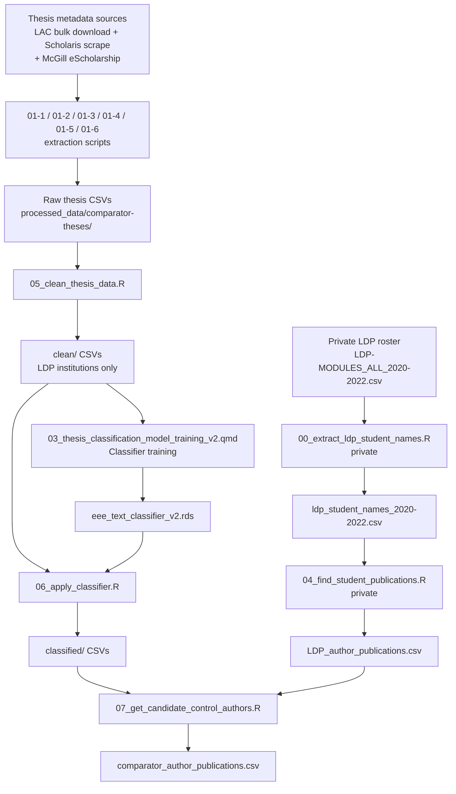

# Thesis Classification Pipeline

## Overview

This repository houses materials for the development and implementation of a text-based machine learning classifier that uses thesis titles and abstracts to distinguish theses covering ecology, evolution, or environment (EEE) from all others. The classifier is applied to thesis metadata from Canadian post-secondary institutions to identify a set of comparator authors — EEE graduate students who were not participants in the Living Data Project (LDP) training program.

The broader research goal is to evaluate whether LDP training affects student publishing behaviour and outcomes by comparing LDP participants with matched non-participant EEE graduate students from the same institutions.

**Note on version control**: This repository is connected to GitHub, but only the `scripts/` directory is currently synced. All data files are kept private via `.gitignore`.

---

## Contributors

| Name | Role | Affiliation | Contact |
|------|------|-------------|---------|
| Jason Pither | PI | Department of Biology & OBIREES, UBC Okanagan | jason.pither@ubc.ca · [ORCID](https://orcid.org/0000-0002-7490-6839) |
| Mathew Vis-Dunbar | Collaborator | Library, UBC Okanagan | [placeholder] |

---

## Project Timeline

| Date | Activity |
|------|----------|
| 2025-10-10 | Project conceived |
| 2026-01-06 | Ethics approval (UBC BREB) |
| 2026-01-13 | Pre-registration initiated |
| 2026-01-13 | README created |
| 2026-02-22 | README last updated |

---

## Methodology

The pipeline proceeds in three broad stages:

1. **Training data assembly**: Thesis metadata is collected from Library and Archives Canada (LAC) and institutional Scholaris repositories. A semi-supervised keyword-seeding approach is used to assign provisional EEE / Other labels, which seed a tidymodels text classifier.
2. **Classifier training and application**: The classifier is trained on title + abstract text, reviewed and refined through a manual labelling round, and then applied to all collected theses to produce EEE/Other predictions.
3. **Comparator author identification**: EEE thesis authors who did not participate in the LDP are resolved via the OpenAlex API, and their first-author publications are retrieved. LDP student publications are also retrieved for comparison.

### Pipeline Workflow



---

## File and Directory Structure

```
thesis_classification/
├── README.md
├── scripts/                        # Main analysis scripts (GitHub-synced)
│   ├── README.md
│   ├── 01-1_extract_ubc_thesis_data_from_circle.R
│   ├── 01-2_extract_uot_uoa_theses.R
│   ├── 01-3_extract_uoa_thesis_degrees.R
│   ├── 01-4_McGill_thesis_extraction.R
│   ├── 01-5_McGill_thesis_metadata_extraction.R
│   ├── 01-6_McGill_merge_titles_abstracts.R
│   ├── 02_thesis_classification_model_training.qmd     # v1 classifier (archived)
│   ├── 03_thesis_classification_model_training_v2.qmd  # v2 classifier (current)
│   ├── 05_clean_thesis_data.R
│   ├── 06_apply_classifier.R
│   └── 07_get_candidate_control_authors.R
└── data/                           # Not GitHub-synced (private)
    ├── McGill_redirects.csv                            # Intermediate: McGill scrape (01-4)
    ├── McGill-abstracts.csv                            # Intermediate: McGill scrape (01-5)
    ├── raw_data/
    │   ├── README.md
    │   ├── data-dictionary.md
    │   ├── institution_names.csv
    │   ├── LDP-MODULES_ALL_2020-2022.csv / .xlsx       # Private
    │   ├── Training_event_data.csv / .xlsx
    │   ├── ldp_student_names_2020-2022.csv             # Private
    │   ├── LDP_author_publications.csv                 # Private
    │   └── scripts/                                    # Private processing scripts
    │       ├── 00_extract_ldp_student_names.R
    │       └── 04_find_student_publications.R
    └── processed_data/
        ├── README.md
        ├── data-dictionary.md
        ├── comparator_author_publications.csv
        ├── comparator_checkpoint.rds
        └── comparator-theses/
            ├── [Institution]_Results_*.csv             # Raw scraped thesis data (LAC / Scholaris)
            ├── McGill_theses.csv                       # Raw McGill thesis data (01-6 output)
            ├── clean/                                  # Cleaned thesis CSVs (LDP institutions)
            │   └── not_used/                           # Cleaned CSVs for non-LDP institutions
            ├── classified/                             # Classifier-labelled CSVs (+ prob_EEE)
            └── training-data/                          # Saved model files + review CSVs
```

Scripts are numbered to reflect execution order. Scripts 00 and 04 live in `data/raw_data/scripts/` because they process private data that cannot be synced to GitHub. See the READMEs in each data subdirectory for file-level details.

---

## Requirements and Dependencies

**R version**: [placeholder — specify version used]

**Key packages**: `tidymodels`, `textrecipes`, `openalexR`, `httr2`, `rvest`, `RSelenium`, `here`, `tidyverse`, `dplyr`, `readr`, `stringr`, `purrr`

Most scripts use `here::here()` for path construction and assume the working directory is the project root (`thesis_classification/`). Exception: `01-4` and `01-5` use relative paths directly and must also be run from the project root.

---

## Sharing and Access

- Raw LDP data (student rosters, names) are private and excluded from GitHub.
- Thesis metadata sourced from Library and Archives Canada is publicly available; see the [LAC Theses portal](https://recherche-collection-search.bac-lac.gc.ca/eng/Help/theses).
- Code is shared under the MIT License.
- Data sharing policy upon manuscript submission: [placeholder]

---

## License

MIT License

---

## Acknowledgments

- Living Data Project (LDP) administration staff for providing course roster data.
- OpenAlex for open bibliographic data.
- [Placeholder — funding sources]

---

## Citing

[Placeholder — to be added upon publication or pre-registration]
