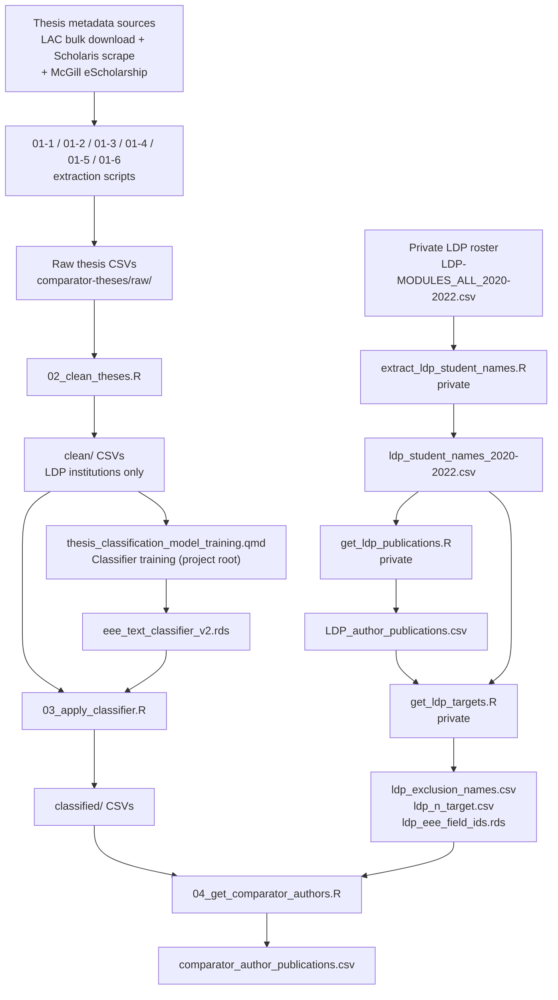

# Thesis Classification Pipeline

## Overview

This repository houses materials for the development and implementation of a text-based machine learning classifier that uses thesis titles and abstracts to distinguish theses covering ecology, evolution, or environment (EEE) from all others. The classifier is applied to thesis metadata from Canadian post-secondary institutions to identify a set of comparator authors — EEE graduate students who were not participants in the Living Data Project (LDP) training program.

The broader research goal is to evaluate whether LDP training affects student publishing behaviour and outcomes by comparing LDP participants with matched non-participant EEE graduate students from the same institutions.

**Note on version control**: This repository is connected to GitHub, but only the `scripts/` directory is currently synced. All data files are kept private via `.gitignore`.

---

## Contributors

| Name | Role | Affiliation | Contact |
|------|------|-------------|---------|
| Jason Pither | PI | Department of Biology & OBIREES, UBC Okanagan | jason.pither@ubc.ca · [ORCID](https://orcid.org/0000-0002-7490-6839) |
| Mathew Vis-Dunbar | Collaborator | Library, UBC Okanagan | [placeholder] |

---

## Project Timeline

| Date | Activity |
|------|----------|
| 2025-10-10 | Project conceived |
| 2026-01-06 | Ethics approval (UBC BREB) |
| 2026-01-13 | Pre-registration initiated |
| 2026-01-13 | README created |
| 2026-02-22 | README last updated |
| 2026-03-22 | Project reorganized: classifier notebook renamed and moved to project root (no numeric prefix); scripts renamed to reflect pipeline stages (01-x scraping, 02 cleaning, 03 classifier application, 04 comparator retrieval); raw thesis CSVs consolidated in `comparator-theses/raw/`; McGill intermediate files moved from `data/` root to `raw/`; v1 and superseded scripts moved to `scripts/supplemental/`; private LDP scripts renamed (no numeric prefix) |

---

## Methodology

The pipeline proceeds in three broad stages:

1. **Training data assembly**: Thesis metadata is collected from Library and Archives Canada (LAC) and institutional Scholaris repositories. A semi-supervised keyword-seeding approach is used to assign provisional EEE / Other labels, which seed a tidymodels text classifier.
2. **Classifier training and application**: The classifier is trained on title + abstract text, reviewed and refined through a manual labelling round, and then applied to all collected theses to produce EEE/Other predictions.
3. **Comparator author identification**: EEE thesis authors who did not participate in the LDP are resolved via the OpenAlex API, and their first-author publications are retrieved. LDP student publications are also retrieved for comparison.

### Pipeline Workflow



---

## File and Directory Structure

```
LDP_thesis_classification/
├── README.md
├── thesis_classification_model_training.qmd    # Classifier training notebook (omnibus)
├── thesis_classification_model_training_cache/ # Quarto render cache
├── scripts/                        # Analysis scripts (GitHub-synced)
│   ├── README.md
│   ├── 01-1_scrape_ubc_theses.R
│   ├── 01-2_scrape_uot_uoa_theses.R
│   ├── 01-3_scrape_uoa_degrees.R
│   ├── 01-4_scrape_mcgill_redirects.R
│   ├── 01-5_scrape_mcgill_abstracts.R
│   ├── 01-6_merge_mcgill_theses.R
│   ├── 02_clean_theses.R
│   ├── 03_apply_classifier.R
│   ├── 04_get_comparator_authors.R
│   └── supplemental/               # Superseded scripts (reference only; see supplemental/README.md)
└── data/                           # Not GitHub-synced (private)
    ├── raw_data/
    │   ├── README.md
    │   ├── data-dictionary.md
    │   ├── institution_names.csv
    │   ├── LDP-MODULES_ALL_2020-2022.csv / .xlsx   # Private
    │   ├── Training_event_data.csv / .xlsx
    │   ├── ldp_student_names_2020-2022.csv          # Private
    │   ├── LDP_author_publications.csv              # Private
    │   ├── ldp_exclusion_names.csv                  # Private (output of get_ldp_targets.R)
    │   ├── ldp_n_target.csv                         # Private (output of get_ldp_targets.R)
    │   ├── ldp_eee_field_ids.rds                    # Private (output of get_ldp_targets.R)
    │   └── scripts/                                 # Private processing scripts
    │       ├── extract_ldp_student_names.R
    │       ├── get_ldp_publications.R
    │       └── get_ldp_targets.R
    └── processed_data/
        ├── README.md
        ├── data-dictionary.md
        ├── comparator_author_publications.csv
        ├── comparator_checkpoint.rds
        └── comparator-theses/
            ├── raw/                                 # Raw scraped thesis CSVs (all institutions)
            │   ├── [Institution]_Results_*.csv      # LAC / Scholaris scraped data
            │   ├── McGill_theses.csv                # Merged McGill thesis data (01-6 output)
            │   ├── McGill_redirects.csv             # McGill scrape intermediate (01-4 output)
            │   └── McGill_abstracts.csv             # McGill scrape intermediate (01-5 output)
            ├── clean/                               # Cleaned thesis CSVs (LDP institutions)
            │   └── not_used/                        # Cleaned CSVs for non-LDP institutions
            ├── classified/                          # Classifier-labelled CSVs (+ prob_EEE)
            └── training-data/                       # Saved model files + review CSVs
```

Scripts in `scripts/` are numbered to reflect their position in the pipeline sequence (Stage 1 = data collection, Stage 2 = cleaning, Stage 3 = classifier application, Stage 4 = comparator retrieval). The classifier training notebook (`thesis_classification_model_training.qmd`) lives at the project root as an unnumbered omnibus document. Private LDP data scripts live in `data/raw_data/scripts/` and are excluded from GitHub.

---

## Reproducibility

### Quick start (Stage 2 onwards)

R package dependencies are managed via `renv`. After cloning:

```r
renv::restore()   # installs all packages at recorded versions
```

Scripts from Stage 2 onwards (`02_clean_theses.R` through `04_get_comparator_authors.R`, plus `thesis_classification_model_training.qmd`) are fully reproducible given the data inputs.

### Stage 1 scripts (data collection)

The Stage 1 scraping scripts (`01-1` through `01-6`) are **not yet fully reproducible** as standalone scripts — they depend on live institutional web repositories (UBC cIRcle, Scholaris, McGill eScholarship) whose structure and availability may change. Full reproducibility of this stage is planned for a future update. The raw scraped outputs are retained in `data/processed_data/comparator-theses/raw/` so that downstream stages can always be reproduced without re-scraping.

### Requirements

**R version**: [placeholder — specify version used]

**Key packages**: `tidymodels`, `textrecipes`, `glmnet`, `openalexR`, `httr2`, `rvest`, `RSelenium`, `here`, `tidyverse`, `dplyr`, `readr`, `stringr`, `purrr`

All scripts use `here::here()` for path construction and assume the working directory is the project root (`LDP_thesis_classification/`).

---

## Sharing and Access

- Raw LDP data (student rosters, names) are private and excluded from GitHub.
- Thesis metadata sourced from Library and Archives Canada is publicly available; see the [LAC Theses portal](https://recherche-collection-search.bac-lac.gc.ca/eng/Help/theses).
- Code is shared under the MIT License.
- Data sharing policy upon manuscript submission: [placeholder]

---

## License

MIT License

---

## Acknowledgments

- Living Data Project (LDP) administration staff for providing course roster data.
- OpenAlex for open bibliographic data.
- [Placeholder — funding sources]

---

## Citing

[Placeholder — to be added upon publication or pre-registration]
