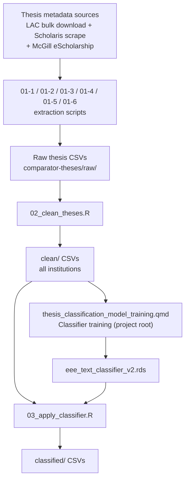

# Thesis Classification Pipeline

## Overview

This repository houses materials for the development and implementation of a text-based machine learning classifier that uses thesis titles and abstracts to distinguish theses covering ecology, evolution, or environment (EEE) from all others. The classifier is applied to thesis metadata from Canadian post-secondary institutions.

**Note on version control**: This repository is connected to GitHub, but only the `scripts/` directory is currently synced. All data files are kept private via `.gitignore`.

---

## Contributors

| Name | Role | Affiliation | Contact |
|------|------|-------------|---------|
| Jason Pither | PI | Department of Biology & OBIREES, UBC Okanagan | jason.pither@ubc.ca · [ORCID](https://orcid.org/0000-0002-7490-6839) |
| Mathew Vis-Dunbar | Collaborator | Library, UBC Okanagan | [placeholder] |

**AI usage**: Claude Code (Sonnet 4.6) contributed to coding and ensuring computational reproducibility, with oversight by Jason Pither. 

---

## Methodology

The pipeline proceeds in two broad stages:

1. **Training data assembly**: Thesis metadata is collected from Library and Archives Canada (LAC) and institutional Scholaris repositories. A semi-supervised keyword-seeding approach is used to assign provisional EEE / Other labels, which seed a tidymodels text classifier.
2. **Classifier training and application**: The classifier is trained on title + abstract text, reviewed and refined through a manual labelling round, and then applied to all collected theses to produce EEE/Other predictions.

### Pipeline Workflow



---

## File and Directory Structure

```
LDP_thesis_classification/
├── README.md
├── thesis_classification_model_training.qmd    # Classifier training notebook (omnibus)
├── thesis_classification_model_training_cache/ # Quarto render cache
├── scripts/                        # Analysis scripts (GitHub-synced)
│   ├── README.md
│   ├── 01-1_scrape_ubc_theses.R
│   ├── 01-2_scrape_uot_uoa_theses.R
│   ├── 01-3_scrape_uoa_degrees.R
│   ├── 01-4_scrape_mcgill_redirects.R
│   ├── 01-5_scrape_mcgill_abstracts.R
│   ├── 01-6_merge_mcgill_theses.R
│   ├── 02_clean_theses.R
│   ├── 03_apply_classifier.R
│   └── supplemental/               # Superseded scripts (reference only; see supplemental/README.md)
└── data/                           # Not GitHub-synced (private)
    ├── institution_names.csv        # Institution abbreviation → full name lookup
    └── processed_data/
        └── comparator-theses/
            ├── raw/                 # Raw scraped thesis CSVs (all institutions)
            │   ├── [Institution]_Results_*.csv      # LAC / Scholaris scraped data
            │   ├── McGill_theses.csv                # Merged McGill thesis data (01-6 output)
            │   ├── McGill_redirects.csv             # McGill scrape intermediate (01-4 output)
            │   └── McGill_abstracts.csv             # McGill scrape intermediate (01-5 output)
            ├── clean/               # Cleaned thesis CSVs (all institutions)
            ├── classified/          # Classifier-labelled CSVs (+ prob_EEE)
            └── training-data/       # Saved model files + review CSVs
```

Scripts in `scripts/` are numbered to reflect their position in the pipeline sequence (Stage 1 = data collection, Stage 2 = cleaning, Stage 3 = classifier application). The classifier training notebook (`thesis_classification_model_training.qmd`) lives at the project root as an unnumbered omnibus document.

---

## Reproducibility

### Quick start (Stage 2 onwards)

R package dependencies are managed via `renv`. After cloning:

```r
renv::restore()   # installs all packages at recorded versions
```

Scripts from Stage 2 onwards (`02_clean_theses.R`, `03_apply_classifier.R`, and `thesis_classification_model_training.qmd`) are fully reproducible given the data inputs.

### Stage 1 scripts (data collection)

The Stage 1 scraping scripts (`01-1` through `01-6`) are **not yet fully reproducible** as standalone scripts — they depend on live institutional web repositories (UBC cIRcle, Scholaris, McGill eScholarship) whose structure and availability may change. Full reproducibility of this stage is planned for a future update. The raw scraped outputs are retained in `data/processed_data/comparator-theses/raw/` so that downstream stages can always be reproduced without re-scraping.

### Requirements

**R version**: [placeholder — specify version used]

**Key packages**: `tidymodels`, `textrecipes`, `glmnet`, `httr2`, `rvest`, `RSelenium`, `here`, `tidyverse`, `dplyr`, `readr`, `stringr`, `purrr`

All scripts use `here::here()` for path construction and assume the working directory is the project root (`LDP_thesis_classification/`).

---

## Sharing and Access

- Thesis metadata sourced from Library and Archives Canada is publicly available; see the [LAC Theses portal](https://recherche-collection-search.bac-lac.gc.ca/eng/Help/theses).
- Code is shared under the MIT License.
- Data sharing policy upon production of any outputs: [placeholder]

---

## License

MIT License

---

## Acknowledgments

- [Placeholder — funding sources]

---

## Citing

[Placeholder]
